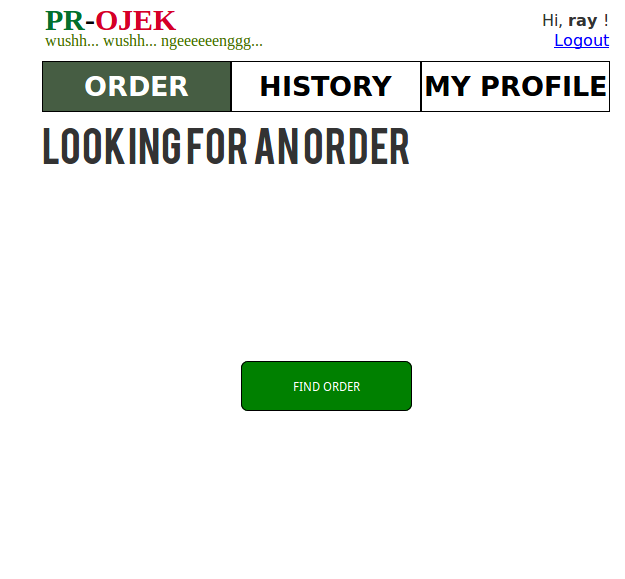
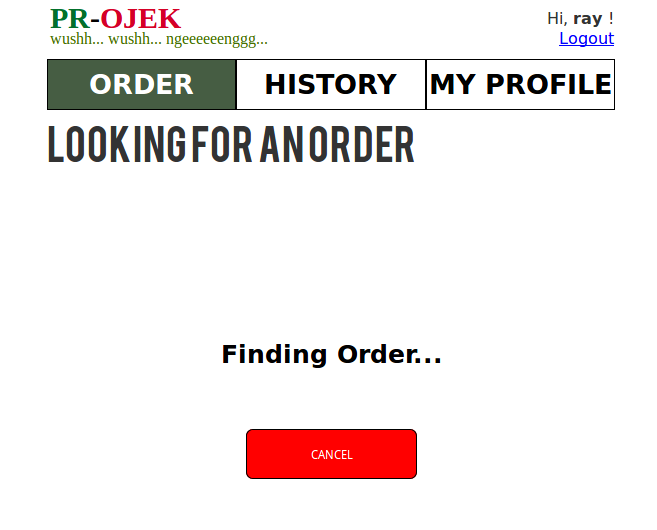
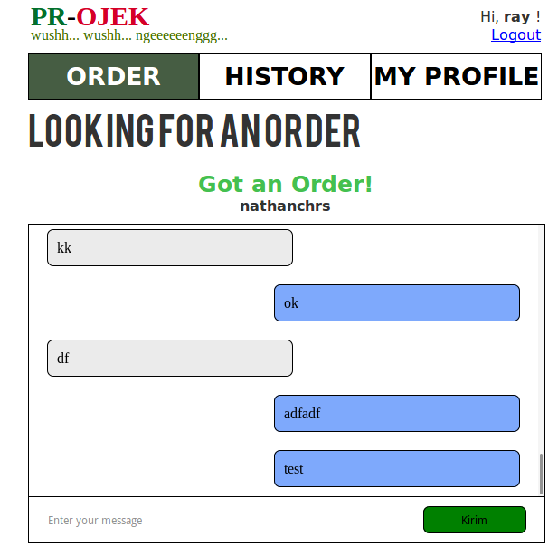
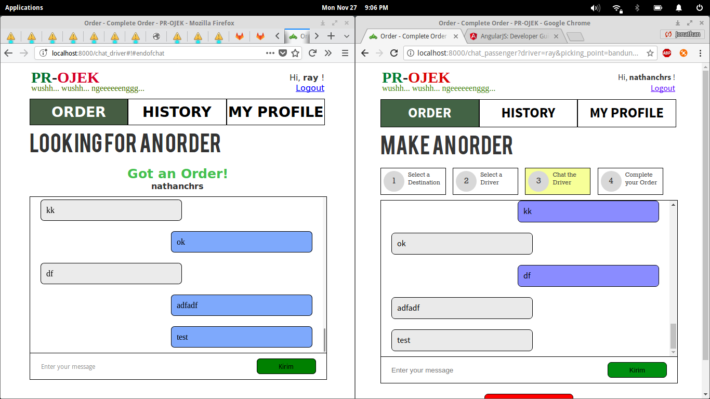
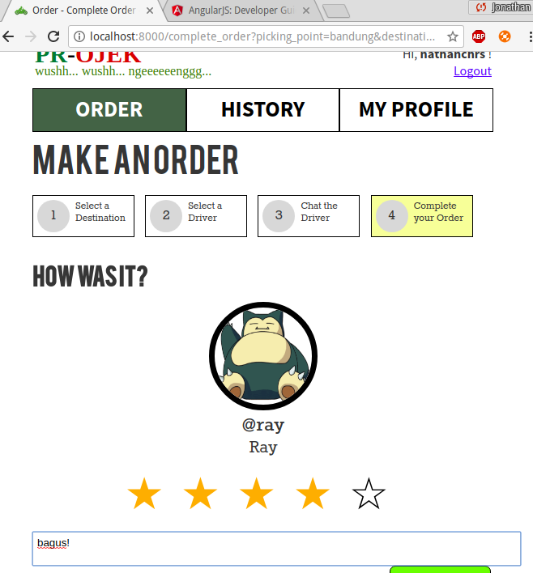

# Tugas 3 IF3110 Pengembangan Aplikasi Berbasis Web

Melakukan upgrade Website ojek online sederhana pada Tugas 2 dengan mengaplikasikan ***cloud service* (Firebase Cloud Messaging) dan *framework* MEAN stack**.

## Memasang *development environment*

### Java 8 SDK

See [https://medium.com/coderscorner/installing-oracle-java-8-in-ubuntu-16-10-845507b13343].

### IntelliJ IDEA Ultimate (2017.1.3 or later)

1. Apply for JetBrains Products for Learning: [https://www.jetbrains.com/shop/eform/students]
2. Download IntelliJ IDEA Ultimate from [https://www.jetbrains.com/idea/download]
3. Install: [https://www.jetbrains.com/help/idea/installing-and-launching.html]

### GlassFish 5.0

1. Download GlassFish 5.0 Full Platform: [http://download.java.net/glassfish/5.0/release/glassfish-5.0.zip]
2. Extract ZIP to `/opt`: `sudo unzip glassfish-5.0.zip -d /opt`
3. Add write permissions to domains directory: `sudo chmod o+w /opt/glassfish5/domains -R`

Note: if using Docker, GlassFish 5.0 is only required for the GlassFish integration plugin to find required JARs.

### Menjalankan pada Docker

Prerequisites:
- [https://docs.docker.com/engine/installation/linux/docker-ce/ubuntu/#install-using-the-repository](Docker CE)
- [https://docs.docker.com/compose/install/#install-compose](Docker Compose)

For development (combined in Docker Compose), run `docker-compose up` in the repository directory.
GlassFish and MySQL is now running:
- WebApp: port 8000, GlassFish admin page at 48480
- IdentityService: port 8001, GlassFish admin page at 48481, PHPMyAdmin at 12341
- WebService: port 8002, GlassFish admin page at 48482, PHPMyAdmin at 12342

You can now run each application using the `GlassFish 5.0.0 on Docker` task in IntelliJ IDEA.

To run each application separately:
1. Change directory using `cd WebApp`, `cd WebService`, or `cd IdentityService`
2. `docker-compose up` in the project directory
3. Run the `GlassFish 5.0.0 on Docker` task in IntelliJ IDEA for each application

### MySQL/MariaDB (tanpa Docker)

See [https://www.digitalocean.com/community/tutorials/how-to-install-mysql-on-ubuntu-16-04].
Or install using LAMPP: [https://www.apachefriends.org/faq_linux.html].

## Tujuan Pembuatan Tugas

Diharapkan dengan tugas ini Anda dapat mengerti:
* MEAN stack (Mongo, Express, Angular, dan Node)
* *Cloud service* Firebase Cloud Messaging (FCM) dan kegunaannya.
* Web security terkait access token dan HTTP Headers.

## Arsitektur Umum Server

Tugas 3 ini terdiri dari komponen Tugas 2 dan tambahan yang harus dibuat:
* `Pemanfaatan FCM`: Pengiriman pesan dari pelanggan ke driver atau sebaliknya dengan menggunakan layanan Firebase Cloud Messaging (FCM).
* `Implementasi MEAN stack`: Membuat REST service untuk keperluan layanan chat memanfaatkan FCM menggunakan Node, Express dan Mongo, serta membuat halaman chat yang menggunakan Angular.

## Deskripsi Tugas

Kali ini, kami diminta untuk merubah sedikit fungsionalitas order yang sudah ada dan menambah fungsionalitas chat pada aplikasi yang telah kami buat pada tugas 2. Aplikasi ini akan menggunakan MEAN stack untuk halaman chat dan REST service, serta menggunakan layanan cloud Firebase Cloud Messaging sebagai media penyampaian pesan. Selain itu, kami juga diminta untuk mengimplementasikan beberapa fitur security. Spesifikasi untuk tugas ini adalah sebagai berikut:

1. Halaman Order akan bergantung pada status pengguna, apakah driver atau bukan.
2. Bila status pengguna merupakan driver maka pada halaman order akan ditampilkan fitur finding order dimana akan membuat driver visible ketika user ingin melakukan order pada halaman select driver. Apabila driver tidak melakukan finding order, maka driver tidak akan ditampilkan pada halaman select driver ketika pengguna non driver melakukan order.
3. Pengguna dapat saling bertukar pesan dengan driver secara realtime di halaman order chat driver. Fitur ini harus diimplementasikan dengan MEAN stack, di mana fitur halmaman chat harus diimplementasikan dengan Angular dan fitur REST service diimplementasikan menggunakan Node, Express, dan Mongo.
4. REST service yang akan menghubungkan client dan Firebase Cloud Messaging. Rincian service ini akan dijelaskan kemudian. Silahkan pelajari cara mendaftar ke layanan Firebase, dan cara membuat project baru.
5. Pengguna harus login terlebih dahulu sebelum dapat melakukan chat. Silahkan cari cara untuk sharing session antara JSP dan MEAN. Sebagai contoh, anda dapat menggunakan cookie yang dapat diakses oleh keduanya.
6. Pada halaman order select driver, aplikasi hanya menampilkan driver yang **sesuai requirement** saja (lihat poin 7). Ketika nama driver dipilih, maka akan muncul kotak chat antar pengguna non driver dan driver pada tab chat driver di halaman order.
7. Requirement yang dimaksud ialah driver memiliki preferred location yang dituju pengguna, online, **sedang melakukan finding order**, dan tidak sedang mendapat order.
8. Pengguna dengan IP address yang berbeda tidak dapat menggunakan access token yang sama.
9. Pengguna dengan user-agent yang berbeda tidak dapat menggunakan access token yang sama. Dalam hal ini, user-agent yang dimaksud adalah web browser yang digunakan.
10. Komponen yang harus digunakan pada AngularJS adalah:
    * Data binding (ng-model directives)
    * Controllers (ng-controllers)
    * ng-repeat, untuk menampilkan list
    * $http untuk AJAX request
    * $scope untuk komunikasi data antara controller dengan view.
    * ng-show dan ng-hide untuk menampilkan/menyembunyikan elemen
11. Tidak perlu memperhatikan aspek keamanan dan etika dalam penyimpanan data.

### Rincian REST Service
1. REST service untuk keperluan chatting **wajib** diimplementasikan dengan **Node dan Express**.
2. REST service menangani hal-hal sebagai berikut.
    * Memberikan daftar driver yang sesuai requirement (sesuai deskripsi tugas nomor 7)
    * Menyimpan identitas (token FCM) dari masing-masing pengguna yang sedang online
    * Menerima *request* dari user A untuk chat ke user B, lalu membuat *request* ke FCM untuk pengiriman pesan ke token FCM user B.
    * Menyimpan ke basis data history chat dari seorang pemesan dan seorang driver. Misalkan A pernah memesan driver B. Jika suatu saat A akan memesan lagi ke driver B, maka kotak chat menampilkan chat yang dilakukan pada pemesanan sebelumnya.
3. Untuk penyimpanan history chat, basis data yang digunakan **wajib Mongo**. Anda tidak diperkenankan menggunakan basis data yang lain, termasuk layanan Firebase Database.

### Halaman Tambahan
1. Halaman Order pada pengguna non driver, terdapat tambahan chat driver pada tahap ketiga
2. Halaman Order pada pengguna driver

### Rincian Arsitektur Aplikasi Chat

Proses untuk komunikasi antar client adalah sebagai berikut:
1. Ketika client dijalankan, client akan meminta token (token yang berbeda dengan token untuk authentication dari Identity Service) dari FCM.
2. FCM mengirimkan token ke client.
3. Setelah token diterima, client akan mengirim token serta identitas dari client (nama/email) ke chat server. Identitas client digunakan untuk mengidentifikasi kepemilikan token.
4. Untuk mengirim pesan kepada client lain, client pertama mengirimkan pesan yang berisi identitas pengirim, identitas tujuan, dan isi pesan ke chat server.
5. Chat server kemudian akan mencari token yang terkait dengan identitas tujuan.
6. Chat server lalu mengirim request ke FCM untuk mengirimkan pesan kepada client dangan token yang terkait.
7. FCM mengirimkan pesan kepada tujuan.

### Asumsi yang Digunakan
1. Pada tugas ini, diasumsikan kedua client sedang aktif. Aplikasi hanya akan dijalankan pada localhost, sehingga memerlukan 2 browser yang berbeda untuk mensimulasikan client yang berbeda. Aplikasi berjalan pada localhost karena browser mensyaratkan sumber aplikasi harus aman untuk operasi-operasi yang digunakan pada aplikasi ini. Localhost termasuk lokasi yang diperbolehkan oleh browser.
2. Kedua browser tersebut harus dalam keadaan aktif dan terfokus, serta tidak terminimize. Hal ini karena cara kerja service worker, yang hanya dapat memberikan notifikasi, dan tidak dapat melakukan manipulasi halaman apabila web browser tidak sedang terfokus ketika pesan datang.
Selain itu, seorang pengguna hanya dapat chatting dengan 1 pengguna lain dalam 1 waktu, sehingga hanya 1 kotak chat yang ditampilkan.
3. Driver hanya dapat menerima satu order dari satu user pada satu waktu.

### Skenario Chatting
Skenario penggunaan aplikasi adalah sebagai berikut.
Misal pengguna A adalah non driver, dan pengguna B adalah driver.
1. A dan B login untuk masuk ke aplikasi.
2. B melakukan finding order pada halaman Order. A memasuki halaman Order.
3. A melakukan order dan memilih driver yang sedang online dan tersedia (driver B).
4. Kotak chat akan muncul di halaman Chat Driver pada layar A. Kotak chat juga akan muncul pada halaman Order pada B.
5. A mengetikkan pesan, dan menekan tombol kirim.
6. Pesan dikirim ke B melalui chat server dan FCM.
7. Ketika pesan sudah diterima di B, kotak chat pada layar B akan muncul.
8. B dapat membalas chat dari A.
9. Apabila A sudah melakukan submit rating maka chatbox pada B akan hilang dan kembali menampilkan halaman finding order.

### Tampilan Program
Halaman Order pada Driver

Pada saat dilakukan "Find Order", maka akan dilakukan pemanggilan terhadap api findorder yang disediakan pada chat service untuk mengubah status seorang driver menjadi online. Apabila api findorder berhasil menerima request ini maka akan dikembalikan status OK. 

Halaman Order pada Driver Ketika Melakukan Finding Order

Pada saat dilakukan "Finding Order", akan dilakukan pemanggilan terhadap api checkorder secara berkala untuk mendeteksi apabila terdapat passenger yang memilih driver yang bersangkutan. Apabila seorang passenger memilih driver tersebut, maka akan dikembalikan username passenger yang bersangkutan. Jika tidak, maka akan dikembalikan nilai null. Pada saat button "Cancel" ditekan sebelum terdapat passenger yang memilih driver tersebut, maka akan dipanggil api cancelfindorder untuk mengubah status driver menjadi offline sehingga driver menjadi tidak visible pada passenger.

Halaman Order pada Driver Ketika Mendapat Order

Pada saat memasuki halaman "Chat Driver", client akan melakukan request pada FCM untuk mendapatkan token dan akan memanggil api update token untuk mengirimkan token tersebut ke server. Server akan menyimpan token FCM untuk driver tersebut untuk keperluan bertukar pesan antara driver dengan passenger. Selain itu, untuk menampilkan chat history, akan dipanggil api gethistory yang akan memberikan response berupa array of chat antar driver dan passenger. Pada saat driver mengirim pesan kepada passenger, pesan akan dipush ke array untuk ditampilkan pada layar. Selain itu, juga akan dilakukan pemanggilan terhadap api sendchat agar server dapat menyimpan history chat tersebut. 

Halaman Order pada Pengguna, Chat Driver

Pada saat memasuki halaman "Order Select Driver", client akan melakukan request pada FCM untuk mendapatkan token dan akan memanggil api update token untuk mengirimkan token tersebut ke server. Server akan menyimpan token FCM untuk passenger tersebut untuk keperluan bertukar pesan antara driver dengan passenger. Selain itu, untuk menampilkan chat history akan dipanggil api gethistory yang akan memberikan response berupa array of chat antar driver dan passenger. Pada saat passenger mengirim pesan kepada driver, pesan akan dipush ke array untuk ditampilkan pada layar. Selain itu, juga akan dilakukan pemanggilan terhadap api sendchat agar server dapat menyimpan history chat tersebut. 

Perlu diperhatikan bahwa chat yang dikirim oleh user yang sedang login berada disisi sebelah kanan dan lawan chatnya lain di sisi sebelah kirim. Isi chat jga harus ditampilkan sesuai urutan waktu diterima (paling atas adalah chat paling lama dan makin ke bawah chat makin baru).

Halaman Complete Order pada Pengguna

Pada saat "Complete Order" ditekan, api endorder akan dipanggil untuk mengubah status passenger dan status driver pada database menjadi offline.

### Pembagian Tugas

*Chat App Front-end :*
1. Send Chat : 13515001 
2. Find Order : 13515001
3. Get History : 13515001
4. Save Chat : 13515073
5. Update Token : 13515073
6. Cancel Find Order : 13515073
7. Check Order : 13515073
8. Check End Order : 13515124
9. Start Order : 13515124
10. Order Select Driver : 13515124
11. End Order : 13515124
12. Request Token from FCM : 13515001, 13515124  

*Chat REST Service :*  
1. Send Chat : 13515001  
2. Find Order : 13515001
3. Get History : 13515001
4. Save Chat : 13515073
5. Update Token : 13515073
6. Cancel Find Order : 13515073
7. Check Order : 13515073
8. Check End Order : 13515124
9. Start Order : 13515124
10. Order Select Driver : 13515124
11. End Order : 13515124
12. Send Message with Token FCM : 13515073

*Fitur security (IP, User-agent) :*
1. Change Token Structure : 13515001
2. Validate Token : 13515001

Lain-lain:
1. Setup *project* dan Docker - 13515001

## Referensi

- [https://docs.oracle.com/javaee/7/tutorial/]
- [https://www.jetbrains.com/help/idea/developing-a-java-ee-application.html]
- [https://www.jetbrains.com/help/idea/web-services.html]
- [https://www.jetbrains.com/help/idea/web-service-clients.html]
- [https://www.gitignore.io/api/java-web%2Cintellij]
- [https://www.digitalocean.com/community/tutorials/how-to-install-glassfish-4-0-on-ubuntu-12-04-3]

## About

**Kelompok 1 K-01 / Silmarillion**

- 13515001 - Jonathan Christopher
- 13515073 - Ray Andrew
- 13515124 - Rachel Sidney Devianti

Dosen: Yudistira Dwi Wardhana | Riza Satria Perdana | Muhammad Zuhri Catur Candra